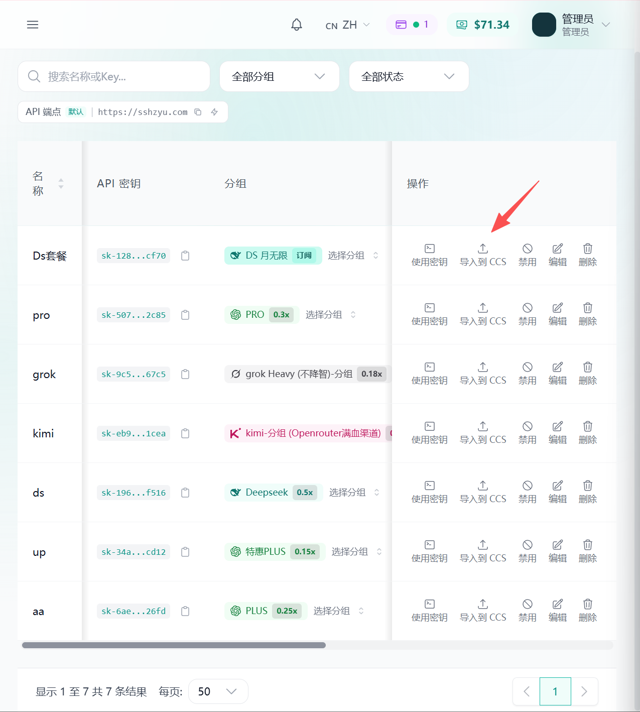
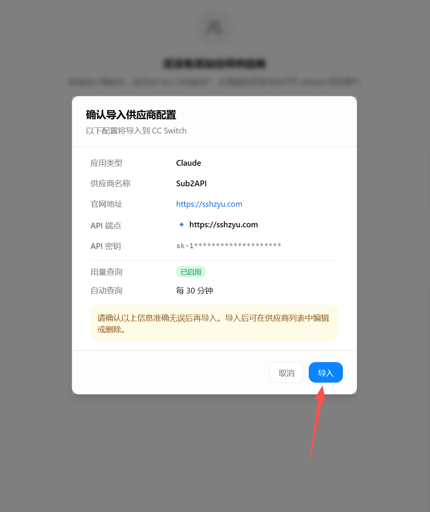
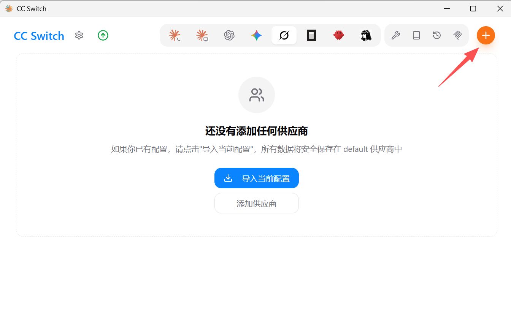
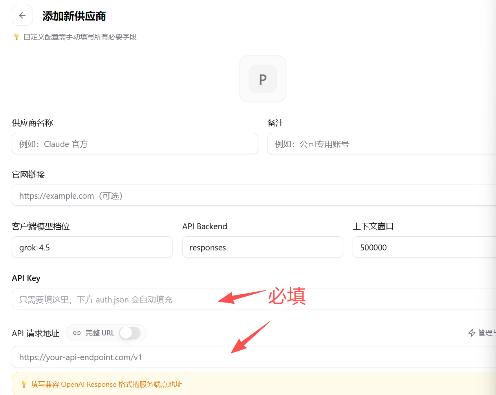
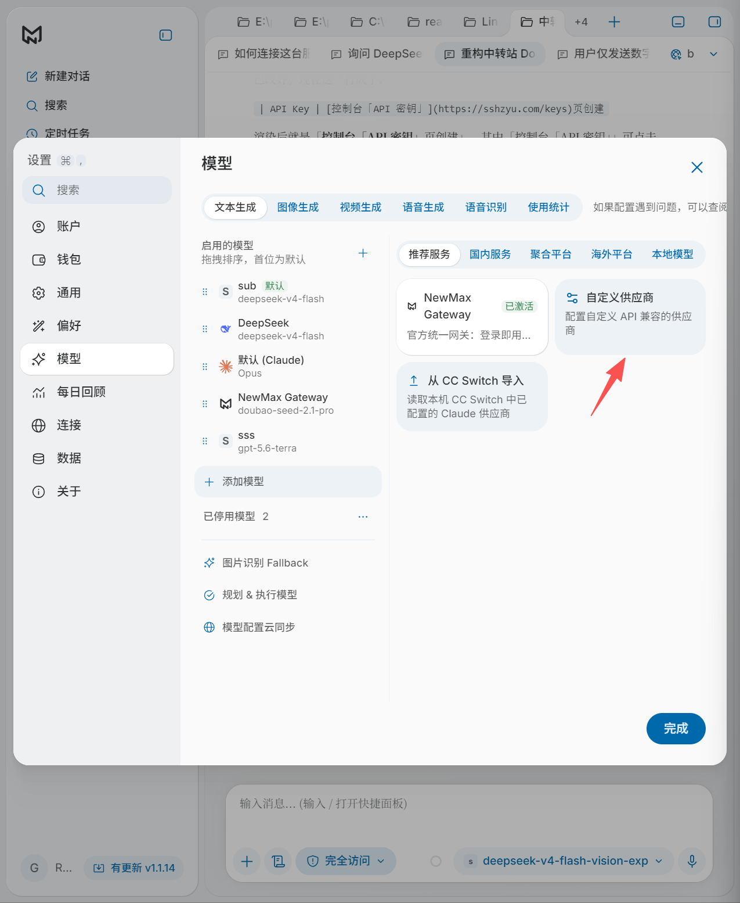
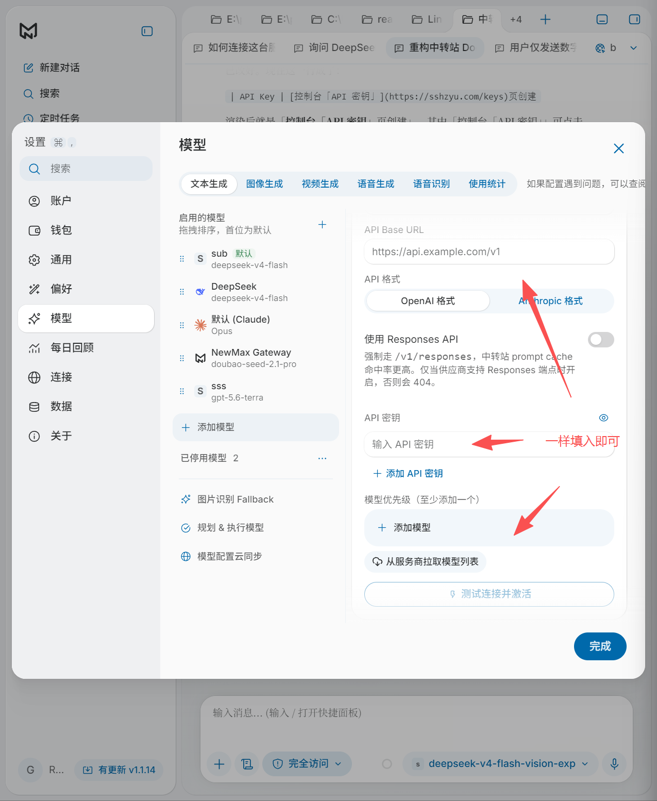

# 接入指南 · [sshzyu.com](http://sshzyu.com)

## 1. Quick Start

### 配置


| 参数          | 值                                                                                         |
| ----------- | ----------------------------------------------------------------------------------------- |
| Base URL    | `https://sshzyu.com/v1`                                                                   |
| API Key     | [控制台「API 密钥」](https://sshzyu.com/keys)页创建                                                 |
| 认证头         | `Authorization: Bearer YOUR_API_KEY`                                                      |
| 对话接口        | `POST https://sshzyu.com/v1/chat/completions`                                             |
| GPT 图片接口    | `POST https://sshzyu.com/v1/images/generations`、`POST https://sshzyu.com/v1/images/edits` |
| Gemini 图片接口 | `POST https://sshzyu.com/v1beta/models/{model}:generateContent`                           |


## 2. 客户端接入

本节讲如何把控制台创建好的 API 接入到常用客户端。前置：先在 [API 密钥](/keys) 页创建好一把密钥（见 Quick Start）。

### 2.1 接入 Claude Code / Codex

[CC Switch](https://cc-switch.com) 是一个管理 Claude Code、Codex 等多个客户端供应商配置的切换工具。本站支持一键导入，地址和密钥会自动填好。

**方式一：一键导入（推荐）**

1. 登录 [控制台](https://sshzyu.com)，打开 [API 密钥](/keys)。
2. 找到要用的密钥，点「导入 CC Switch」。
3. 浏览器唤起 CC Switch，自动填入 Base URL 和 API Key，确认即可。
4. 在 CC Switch 切换到该供应商，重启 Claude Code / Codex。

> 若浏览器没有唤起，说明未安装 CC Switch，安装后重试。





**方式二：手动添加**

1. 打开 CC Switch →「供应商」→「新增供应商」。
2. 选择要接入的客户端（Claude Code / Codex）。
3. 按下表填写后保存。
4. 切换到该供应商，并重启客户端。


| 项                | 值                    |
| ---------------- | -------------------- |
| 名称               | sshzyu               |
| 客户端              | Claude Code / Codex  |
| API 地址（Base URL） | `https://sshzyu.com` |
| API Key          | 控制台「API 密钥」创建        |
| 模型（Codex 选填）     | `gpt-5.5`            |


> 手动填写的地址以「一键导入」自动带出的为准；不同客户端的协议路径由 CC Switch 自动补齐。





### 2.2 接入 NewMax 客户端

[NewMax](https://newmax.cc/download) 是一款本地优先的桌面 AI Agent 客户端，支持添加自定义提供商（OpenAI、Claude、DeepSeek 等 15+）。本站兼容 OpenAI 接口，可直接接入。

**方式一：手动添加**

1. 打开 NewMax，点击侧栏底部头像 →「设置」。
2. 点左侧「模型」→「添加提供商」。
3. 供应商类型选 OpenAI（兼容）。
4. 按下表填写后点「测试连接」验证，再保存。
5. 回到对话，在右上角模型选择器里选本站模型（如 `gpt-5.6-sol`）。


| 项        | 值                                                         |
| -------- | --------------------------------------------------------- |
| 供应商类型    | OpenAI（兼容）                                                |
| Base URL | `https://sshzyu.com`                                      |
| API Key  | 控制台「API 密钥」创建                                             |
| 可选模型     | `gpt-5.6-sol`、`gpt-5.5`、`deepseek-v4-flash`、`mimo-v2.5` 等 |


&nbsp;





**方式二：从 CC Switch 导入**

已在 CC Switch 加过本站时，可直接导入：

1. 设置 → 模型 →「添加模型」。
2. 供应商目录点「从 CC Switch 导入」。
3. 勾选本站供应商（CC Switch 用了自定义数据目录时，点「选择数据库文件」选 `cc-switch.db`）。
4. 点「导入」，NewMax 会自动带入 Base URL、API Key 和模型列表。  

## 3. 如何让 Codex 接入生图能力

把下面这段提示词发给 Codex（或任何 Agent），它会按照 [生图接入规范](https://sshzyu.com/docs/install/iamge_gen.md) 自动完成生图脚本的编写、封装为 Skill 装入全局，并实际生成一张图验证：

```text
key: [填入你申请的key]
请根据 https://sshzyu.com/docs/install/iamge_gen.md 内的规范做好生图skills
```

> 使用前置：先在 [API 密钥](/keys) 页创建好一把密钥，并确认其所在分组已开通「图片生成」权限；把提示词中的 `key` 替换为你的密钥。

## 4. 错误码

### CODE / DESCRIPTION


| CODE  | DESCRIPTION          | Cause                  | Solution                         |
| ----- | -------------------- | ---------------------- | -------------------------------- |
| `400` | Invalid Format       | 请求体格式错误，或缺少必填字段        | 按 `error.message` 修改请求体          |
| `401` | Authentication Fails | API Key 无效、缺失或鉴权失败     | 检查 API Key、`Bearer` 前缀和请求地址      |
| `402` | Insufficient Balance | 账户余额不足                 | 到控制台充值后重试                        |
| `403` | Permission Denied    | API Key 所属分组无权访问该模型或接口 | 检查分组权限、模型权限和接口类型                 |
| `404` | Not Found            | 路径、模型或异步任务不存在          | 检查 URL、模型 ID；查询任务时使用提交任务的同一把 Key |
| `422` | Invalid Parameters   | 参数值不合法，或当前模型不支持该参数     | 按 `error.message` 修改参数           |
| `429` | Rate Limit Reached   | 请求频率、并发数或等待队列达到上限      | 降低请求频率，使用指数退避后重试                 |
| `500` | Server Error         | 服务端内部错误                | 稍后重试；持续失败时提供请求 ID                |
| `502` | Bad Gateway          | 上游模型服务返回异常             | 稍后重试；持续失败时提供请求 ID                |
| `503` | Server Overloaded    | 服务或可用模型账户暂时繁忙          | 稍后重试，或换用其它已开通模型                  |


### 排查顺序

1. 检查请求地址、请求方法和 `Authorization` 请求头。
2. 检查 `model` 是否为控制台当前开通的模型 ID。
3. 检查请求体格式、必填参数和接口类型是否匹配。
4. 检查余额、频率、并发和分组权限。
5. 仍然失败时，记录 HTTP 状态码、错误消息和请求 ID，联系管理员。

## 5. 联系方式

需要技术支持或反馈，请联系管理员。


&nbsp;