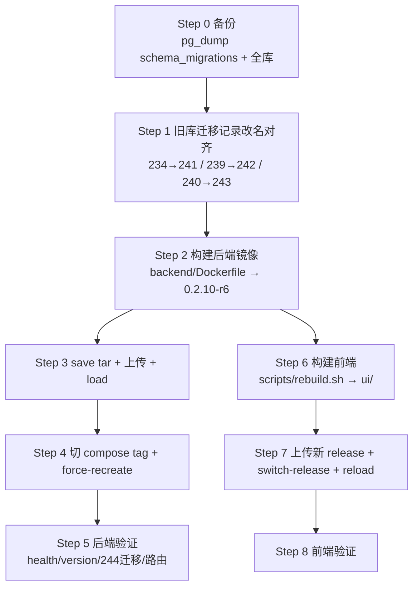

# 线上部署文档 · sub2api 0.2.10-r6（官方 v0.2.10 + 本地定制）

> **历史归档，禁止按本文直接部署当前版本。** 本文记录当时的 `0.2.10-r6` 迁移前提及步骤，不适用于当前 `0.2.11-r6`；迁移记录、版本身份和线上状态须按当前方案重新核实。本文不是部署授权。

> 目标服务器：**us-server**（`64.83.2.153`）
> 交付物：后端镜像 `local/sub2api-batch:0.2.10-r6` + 前端 UI
> 说明：本文档是把「本地已合并并验证通过（本地 docker 栈 + 全量 293 个 migration 全新迁移成功）」的版本，部署到线上 us-server 的完整操作手册。**支持无损升级（不丢线上数据）。**

---

## 0. 背景

本地已把 **官方 sub2api v0.2.10** 与 **本地定制**（lottery 抽奖系统、batch_image 批量图像、key_group_provider）合并，版本号定为 `0.2.10-r6`。合并要点：

- 官方 v0.2.10 新功能（`claude-sonnet-5-5` 模型、`claude/reset-credits`、内容审核引擎 `risk-control`、`openai_referral`、`backup_restore_state` 等）全部并入。
- 本地定制（lottery 的 13 条 admin 路由、batch_image 增强、key_group_provider）完整保留。
- **Migration 重排**：本地 lottery/batch_image 迁移从旧编号 `234/239/240` 重排到 `241/242/243`，官方新增的 `244_lottery_activity_tier_config.sql` 为新迁移。

**为何需要迁移对齐**：
迁移执行器（`migrations_runner.go`）以 `schema_migrations.filename` 为主键、checksum 为 `TrimSpace 后 SHA256`。启动时：文件名能查到且 checksum 匹配 → 跳过；查不到 → 当作全新迁移**重复执行**。
线上旧库当前记录的是**旧编号**（`234_batch_image_idempotency_unique`、`239_lottery`、`240_lottery_tier`）。若直接启动新镜像，新的 `241/242/243` 文件名在旧库中**无记录** → 会重复建表 → 冲突启动失败。

**关键前提已逐字节验证**：合并时三个迁移文件是**纯改名、内容字节一致**，因此新文件名下 checksum 与旧库记录相同。改名对齐后，新镜像启动时会查到记录且校验通过 → 跳过这三个，只执行真正新增的 `244`。

| 新编号（新镜像内） | checksum | 旧编号（旧库记录） | checksum | 结论 |
|---|---|---|---|---|
| `241_batch_image_idempotency_unique.sql` | `a5a889db…d4ae183` | `234_batch_image_idempotency_unique.sql` | `a5a889db…d4ae183` | ✅ 一致 → 改名后跳过 |
| `242_lottery.sql` | `7a0eacde…cc7ca7` | `239_lottery.sql` | `7a0eacde…cc7ca7` | ✅ 一致 → 改名后跳过 |
| `243_lottery_tier.sql` | `0455bf4…041f2b` | `240_lottery_tier.sql` | `0455bf4…041f2b` | ✅ 一致 → 改名后跳过 |
| `244_lottery_activity_tier_config.sql` | `ba7a5617…fbac3` | 线上无记录 | — | 属**新增迁移** → 应执行 |

> ⚠️ 若你之后又手工改过 `239/240` 的 SQL 内容，checksum 会变，必须先重算确认，否则改名对齐后会被「checksum mismatch」拒绝。

---

## 1. 前置条件与安全红线

- 操作期间保持 **SSH 连接可用**，建议在维护窗口执行。
- **不得**：改回 SSH 密码登录、重启 nginx/fail2ban/cron 等非 sub2api 服务、删除任何日志/数据/备份。
- 关于迁移表：主机制是 `schema_migrations`；`atlas_schema_revisions` 仅用于无历史 baseline，本次无需处理（可选只读确认）。
- **前端与后端为两个独立交付物**，均可独立回滚。

---

## 2. 部署流程图



---

## 3. 后端部署

### Step 0 — 备份（必须，不可跳过）

```bash
ssh us-server 'docker exec sub2api-postgres pg_dump -U sub2api -d sub2api -t schema_migrations > /tmp/schema_migrations_backup.sql && echo "migrations backed up"'
# 建议全库备份一份（放非删除目录）
ssh us-server 'docker exec sub2api-postgres pg_dump -U sub2api -d sub2api > /tmp/sub2api_dump_$(date +%Y%m%d).sql && echo "full db dumped"'
```

### Step 1 — 旧库迁移记录改名对齐（核心一步）

> 只更新 `filename`，**不动 checksum**。此步在旧镜像仍运行时执行，不影响运行中的 r5 容器。

```bash
ssh us-server 'docker exec sub2api-postgres psql -U sub2api -d sub2api -c "
UPDATE schema_migrations SET filename = '\''241_batch_image_idempotency_unique.sql'\'' WHERE filename = '\''234_batch_image_idempotency_unique.sql'\'';
UPDATE schema_migrations SET filename = '\''242_lottery.sql'\''              WHERE filename = '\''239_lottery.sql'\'';
UPDATE schema_migrations SET filename = '\''243_lottery_tier.sql'\''        WHERE filename = '\''240_lottery_tier.sql'\'';"'

# 确认：3 行已改名、checksum 未变、且无新编号 244 之外的记录
ssh us-server 'docker exec sub2api-postgres psql -U sub2api -d sub2api -c "SELECT filename, checksum FROM schema_migrations WHERE filename LIKE '\''24%'\'' ORDER BY filename"'
# 期望：241 / 242 / 243 三行，checksum 与表格一致；尚无 244
```

### Step 2 — 本地构建后端镜像

`backend/Dockerfile` 为**纯 Go 构建**（`golang:1.27.0-alpine`，无前端）。在工作区仓库 `backend/` 目录执行：

```bash
cd /f/中转站运营/sshzy/backend
# 归档示例（不应照此构建当前版本）：正式构建须按当前 AGENTS.md 提供 VERSION、COMMIT、DATE，并先校验洁净输入。
# docker build -t local/sub2api-batch:0.2.10-r6 .  # 历史命令；当前 Dockerfile 会拒绝缺失身份参数的正式构建
# 验证版本注入（走 resolve-version.sh 读 cmd/server/VERSION = 0.2.10-r6）
docker run --rm local/sub2api-batch:0.2.10-r6 /app/main --version   # 应报 Sub2API 0.2.10-r6
```

### Step 3 — 导出、上传、加载

```bash
cd /f/中转站运营/sshzy
docker save local/sub2api-batch:0.2.10-r6 | gzip -6 > /tmp/sub2api-0.2.10-r6.tar.gz

# 上传（WSL 内含 rsync；服务器无法访问本地 docker registry）
# 历史上传示例已停用：必须使用经本机 SSH 配置校验的 us-server 主机身份，不得关闭 StrictHostKeyChecking。
# rsync -e ssh -avP /tmp/sub2api-0.2.10-r6.tar.gz us-server:/tmp/
# 若无 rsync，用 scp
# scp /tmp/sub2api-0.2.10-r6.tar.gz root@64.83.2.153:/tmp/

ssh us-server 'docker load -i /tmp/sub2api-0.2.10-r6.tar.gz'
```

### Step 4 — 切换 compose tag 并重建容器

```bash
ssh us-server '
sed -i "s|local/sub2api-batch:[^ ]*|local/sub2api-batch:0.2.10-r6|g" /opt/sub2api-deploy/docker-compose.yml
cd /opt/sub2api-deploy && docker compose up -d --no-build --force-recreate sub2api'
```

### Step 5 — 后端验证

```bash
ssh us-server '
docker exec sub2api /app/main --version                                             # 0.2.10-r6
curl -s -o /dev/null -w "%{http_code}\n" http://127.0.0.1:8080/health                 # 200
docker exec sub2api-postgres psql -U sub2api -d sub2api -c "SELECT filename FROM schema_migrations WHERE filename LIKE '\''24%'\'' ORDER BY filename"'
# 期望：241 / 242 / 243（改名后跳过）+ 244（新增，刚执行）；若出现 244 即可视为迁移正确落地
docker logs sub2api 2>&1 | grep -iE "lottery|reset-credits|moderation" | head          # 路由注册确认
```

---

## 4. 前端部署

前端与后端独立，源码在 `frontend/`，构建产物装配到 `ui/`。本次前端**已含 lottery 页面**（`LotteryManageView.vue`、`LotteryView.vue`、`ProfileLotteryCard.vue`、`lottery.ts` 及中英文 i18n），需一并上线。

### Step 6 — 本地构建前端

```bash
cd /f/中转站运营/sshzy
bash scripts/rebuild.sh     # install → build → fw-cachebust → 装配到 ui/
# 本地验证（可选）:  http://127.0.0.1:8080/
```

### Step 7 — 上传新 release 并切换

> 建议做成新 release 目录以支持回退，不要直接覆盖 `current`。

```bash
# 1. 服务器上建新 release 目录（<ts> 用当前时间/版本号，如 0.2.10-r6）
ssh us-server 'mkdir -p /opt/sshzyu-ui/releases/0.2.10-r6'

# 2. 上传构建产物（在本地仓库根目录）
cd /f/中转站运营/sshzy
scp -r ui/current/* root@64.83.2.153:/opt/sshzyu-ui/releases/0.2.10-r6/
# 共享资源 assets 若跨版本累积，需确认 shared 是否也需要带头文件；照 AGENTS.md 流程处理

# 3. 切换 current 软链（改软链 + nginx reload，不要手动 ln）
ssh us-server 'bash /opt/sshzyu-ui/switch-release.sh 0.2.10-r6'
```

### Step 8 — 前端验证

```bash
curl -s -o /dev/null -w "%{http_code}\n" https://sshzyu.com/                 # 200
curl -s -o /dev/null -w "%{http_code}\n" https://sshzyu.com/manage/lottery   # SPA 路由，200
# 浏览器访问 lottery 管理页确认页面加载、无白屏
```

---

## 5. 回滚方案

### 后端回滚（代码层）

```bash
ssh us-server '
sed -i "s|local/sub2api-batch:[^ ]*|local/sub2api-batch:0.2.10-r5|g" /opt/sub2api-deploy/docker-compose.yml
cd /opt/sub2api-deploy && docker compose up -d --no-build --force-recreate sub2api'
```

> 数据库中 `244_lottery_activity_tier_config` 新增的表，回滚到 r5 后旧代码不认识、不会主动使用，**无副作用**。
> 若要完全还原迁移记录，用 Step 0 的 `schema_migrations_backup.sql` 恢复。

### 前端回滚

```bash
ssh us-server 'bash /opt/sshzyu-ui/switch-release.sh <上一个可用版本>'
```

---

## 6. 风险与注意事项（独立判断）

1. **迁移对齐必须在部署前、旧镜像仍在跑时做**——只影响启动扫描，不影响运行中的容器。
2. **checksum 一致性是方案成立的前提**，本文档表格中的数据已在本地逐字节验证。若你后续改动过 `239/240` 内容，必须重算。
3. **前端与后端建议一并发布，但可分别回滚**。后端只动 `backend/`，前端只动 `frontend/`。
4. **工作区本次 backend 改动尚未提交**（445 个文件）。**强烈建议部署前先在本地 `git add` + `git commit` 固化**，以保证构建内容可追溯、便于回滚定位。前端 `frontend/` 有未提交改动时同理。
5. **线上 `8080` = sub2api 容器，本地 `8080` = 站点 nginx**——端口语义不同，勿混用。
6. 部署前确认 `atlas_schema_revisions` 表仅为基线（可选只读），避免干扰。

---

*本文档由本地合并验证结果整理，供 us-server 部署参考。执行前请以实际线上状态为准复核。*
