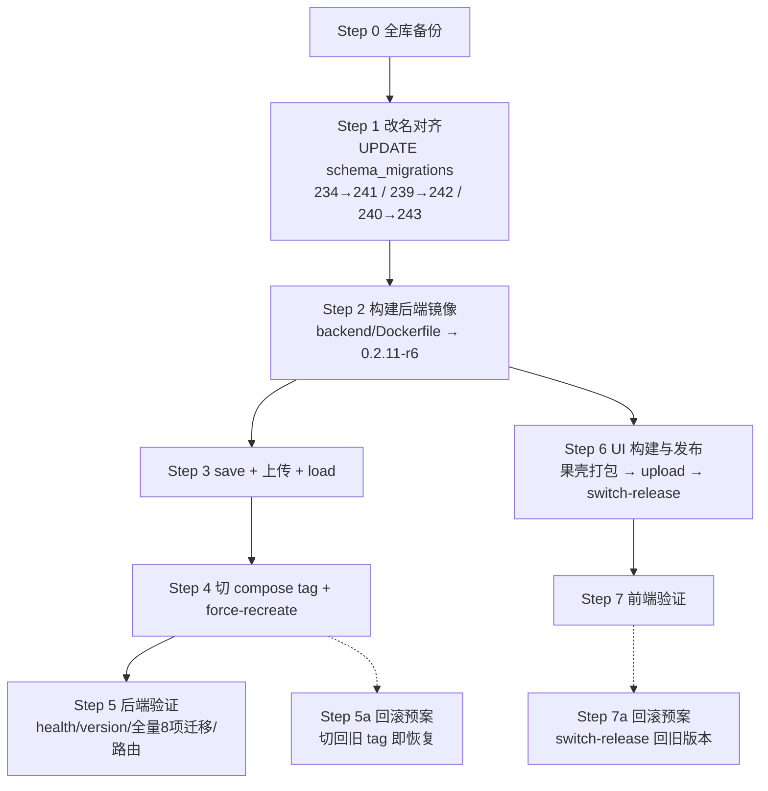

# 线上部署文档 · sub2api 0.2.11-r6（官方 v0.2.11 + 本地定制）

> 目标服务器：**us-server**（`64.83.2.153`）
> 交付物：后端镜像 `local/sub2api-batch:0.2.11-r6` + 前端 UI
> 说明：本文档是把「本地已合并并验证通过」的版本部署到线上 us-server 的完整操作手册。**支持无损升级（不丢线上数据）。**

---

## 0. 背景与版本对照

**版本对照：**

| 环境 | 版本 | HEAD | 工作区 | 说明 |
|---|---|---|---|---|
| 线上 | `0.2.10-r5` | — | 运行中 healthy | compose tag `0.2.10-r5`，前端 `current→20260929-ui-r1` |
| 本地 | `0.2.11-r6` | `562710777` | 洁净 | 已合官方 v0.2.11，含 lottery 动态档位、content_moderation 增强、渠道推理倍率、联盟幂等、批量图片 BATJ |

**本地 0.2.11-r6 的迁移文件总数：294 个 `.sql` 文件（线上 0.2.10-r5 已有 289 条记录）。**

**迁移增量（线上→本地，共 3 个改名对齐 + 5 个新增）：**

### 改名对齐组（线上记录 → 本地文件名，checksum 已逐字节验证一致）

| 线上旧记录（DB） | 本地新文件名 | TrimSpace+SHA256 checksum（前16位） | 结论 |
|---|---|---|---|
| `234_batch_image_idempotency_unique` | `241_batch_image_idempotency_unique.sql` | `a5a889db5bca79c3` | ✅ 一致 |
| `239_lottery` | `242_lottery.sql` | `7a0eacdeb81fcabf` | ✅ 一致 |
| `240_lottery_tier` | `243_lottery_tier.sql` | `0455bf4ac6460303` | ✅ 一致 |

> **验证方法：** 执行器用 `strings.TrimSpace(content) → sha256.Sum256 → hex.EncodeToString`。上述 checksum 已用同一算法从本地文件计算并与线上 `schema_migrations` 记录逐组比对确认。

> **幂等性备注：** 三个改名对齐的迁移内容均为完全幂等（`IF NOT EXISTS` / `CREATE TABLE IF NOT EXISTS` / 带条件 `DO $$` 块）。即使不做对齐直接部署，重执行也能安全通过。改名对齐是为了保持 `schema_migrations` 记录干净，非核心依赖。

### 新增迁移（线上无记录，启动时自动执行）

| 文件名 | 内容摘要 | 操作类型 | 幂等 |
|---|---|---|---|
| `238b_content_moderation_engine_meta.sql` | `content_moderation_logs` 增加 `engine_meta JSONB` | `ADD COLUMN IF NOT EXISTS` | ✅ |
| `239_channel_reasoning_effort_multipliers.sql` | `channel_model_pricing` 增加 `reasoning_effort_multipliers JSONB` + 老字段迁移 | 条件 ALTER + 条件 UPDATE | ✅ |
| `240_affiliate_ledger_operation_id.sql` | `user_affiliate_ledger` 增加 `operation_id` + 唯一索引 | `ADD COLUMN IF NOT EXISTS` + `CREATE UNIQUE INDEX IF NOT EXISTS` | ✅ |
| `244_lottery_activity_tier_config.sql` | `lottery_activities` 增加 `tier_mode`/`tier_thresholds` | `ADD COLUMN IF NOT EXISTS` × 2 | ✅ |
| `245_lottery_dynamic_tiers.sql` | `lottery_activities` 增加 `tier_definitions` | `ADD COLUMN IF NOT EXISTS` | ✅ |

> 所有新增迁移均已核实为幂等操作，引用目标表（`content_moderation_logs`、`channel_model_pricing`、`user_affiliate_ledger`、`lottery_activities`）均存在于线上（由更早期的迁移创建）。

**与旧方案 `0.2.10-r6` 相比变化：**
- 新增 `238b_content_moderation_engine_meta`、`239_channel_reasoning_effort_multipliers`、`240_affiliate_ledger_operation_id`、`245_lottery_dynamic_tiers` 共 4 个新迁移（旧方案只有 1 个）
- 改名对齐的 `234→241` 因版本变更仍保持不变（内容相同，线上市 `0.2.10-r5` 仍用旧编号）

---

## 1. 前置条件与安全红线

- 操作期间保持 **SSH 连接可用**，建议在维护窗口执行。
- **不得**：改回 SSH 密码登录、重启 nginx/fail2ban/cron 等非 sub2api 服务、删除任何日志/数据/备份。
- 关于迁移表：主机制是 `schema_migrations`；`atlas_schema_revisions` 仅用于无历史 baseline，本次无需处理（可选只读确认）。
- **前端与后端为两个独立交付物**，均可独立回滚。
- **本机 githooks 门禁（`pre-push`）不会阻塞部署流程。** 线上构建使用 `docker build`，不产生 `git push`。
- 本机 VERSION = `0.2.11-r6`，HEAD = `562710777`。**正式构建前需确保工作区洁净**（当前已验证为洁净）。

---

## 2. 部署流程图



---

## 3. 后端部署

### Step 0 — 全库备份（必须，不可跳过）

```bash
# 备份 schema_migrations（用于改名回退）
ssh us-server 'docker exec sub2api-postgres pg_dump -U sub2api -d sub2api -t schema_migrations > /tmp/schema_migrations_backup.sql && echo "migrations backed up"'

# 全库备份（存放在非易失目录）
ssh us-server 'docker exec sub2api-postgres pg_dump -U sub2api -d sub2api > /opt/sub2api-deploy/backups/sub2api_dump_0.2.11-r6_pre.sql && echo "full db dumped"'

# 确认备份文件存在且非空
ssh us-server 'ls -lh /tmp/schema_migrations_backup.sql /opt/sub2api-deploy/backups/sub2api_dump_0.2.11-r6_pre.sql'
```

### Step 1 — 旧库迁移记录改名对齐

> 只更新 `filename`，**不动 checksum**。此步在旧镜像仍运行时执行，不影响运行中的 r5 容器。
> **如不想改名对齐**（改用重执行幂等方式），可直接跳过此步到 Step 2。本方案偏好改名对齐以保持记录干净。

```bash
# 改名对齐
ssh us-server 'docker exec sub2api-postgres psql -U sub2api -d sub2api -c "
UPDATE schema_migrations SET filename = '\''241_batch_image_idempotency_unique.sql'\'' WHERE filename = '\''234_batch_image_idempotency_unique.sql'\'';
UPDATE schema_migrations SET filename = '\''242_lottery.sql'\''              WHERE filename = '\''239_lottery.sql'\'';
UPDATE schema_migrations SET filename = '\''243_lottery_tier.sql'\''        WHERE filename = '\''240_lottery_tier.sql'\'';"'

# 确认改名结果：应有 241/242/243 三行，且 checksum 与上面表格一致
ssh us-server 'docker exec sub2api-postgres psql -U sub2api -d sub2api -c "SELECT filename, substring(checksum::text,1,16) AS cksum_short FROM schema_migrations WHERE filename LIKE '\''24%'\'' ORDER BY filename"'
# 期望输出（只展示 24x）：
# 241_batch_image_idempotency_unique.sql | a5a889db5bca79c3
# 242_lottery.sql                        | 7a0eacdeb81fcabf
# 243_lottery_tier.sql                   | 0455bf4ac6460303
# （尚无 244/245 —— 它们是新增迁移，启动时自动执行）

# 验证旧编号已不存在
ssh us-server 'docker exec sub2api-postgres psql -U sub2api -d sub2api -c "SELECT filename FROM schema_migrations WHERE filename IN ('\''234_batch_image_idempotency_unique.sql'\'','\''239_lottery.sql'\'','\''240_lottery_tier.sql'\'')"'
# 期望：空结果（0 rows）
```

### Step 2 — 本地构建后端镜像

**前置检查：工作区必须洁净，VERSION 必须符合预期。**

```bash
# 核验
cd /f/中转站运营/sshzy
git status --porcelain    # 应为空（或仅无关文件）
cat backend/cmd/server/VERSION   # 应为 0.2.11-r6
git log --oneline -1           # 应确认 HEAD

# 正式构建（backend/Dockerfile — 纯 Go 构建，不含前端）
docker build \
  --build-arg VERSION=0.2.11-r6 \
  --build-arg COMMIT=562710777 \
  --build-arg DATE=$(date -u +%Y-%m-%dT%H:%M:%SZ) \
  -t local/sub2api-batch:0.2.11-r6 \
  backend/

# 验证版本注入
docker run --rm local/sub2api-batch:0.2.11-r6 /app/main --version
# 期望：Sub2API 0.2.11-r6 (commit 562710777 ...)

# 检查构建类型标识
docker run --rm --entrypoint cat local/sub2api-batch:0.2.11-r6 /etc/build_type 2>/dev/null
# 期望：release（非 dev）
```

> 当前环境为 Windows，`$(date -u +%Y-%m-%dT%H:%M:%SZ)` 在 Git Bash 中可用。若用 PowerShell，用 `Get-Date -Format 'yyyy-MM-ddTHH:mm:ssZ'`。

### Step 3 — 导出、上传、加载

```bash
cd /f/中转站运营/sshzy

# 导出（压缩）
docker save local/sub2api-batch:0.2.11-r6 | gzip -6 > /tmp/sub2api-0.2.11-r6.tar.gz

# 上传
scp /tmp/sub2api-0.2.11-r6.tar.gz us-server:/tmp/

# 加载
ssh us-server 'docker load -i /tmp/sub2api-0.2.11-r6.tar.gz'

# 确认加载成功
ssh us-server 'docker images local/sub2api-batch:0.2.11-r6 --format "{{.Repository}}:{{.Tag}} ({{.Size}})"'
```

### Step 4 — 切换 compose tag 并重建容器

```bash
ssh us-server '
sed -i "s|local/sub2api-batch:[^ ]*|local/sub2api-batch:0.2.11-r6|g" /opt/sub2api-deploy/docker-compose.yml
cd /opt/sub2api-deploy && docker compose up -d --no-build --force-recreate sub2api'
```

> 若旧 compose 中 service 名不同（如 `sub2api`），按实际加快通过 `docker compose ps` 确认。

### Step 5 — 后端验证

```bash
ssh us-server '
# 5a. 版本
echo "=== VERSION ===" && docker exec sub2api /app/main --version

# 5b. 健康检查
echo "=== HEALTH ===" && curl -s -o /dev/null -w "%{http_code}\n" http://127.0.0.1:8080/health

# 5c. 迁移落地检查（8 项）
echo "=== 24x MIGRATIONS ===" && docker exec sub2api-postgres psql -U sub2api -d sub2api -t -c "SELECT filename FROM schema_migrations WHERE filename LIKE '\''24%'\'' ORDER BY filename"
# 期望：241 / 242 / 243（改名跳过）+ 244 / 245（新增已执行）
# 同时检查 238b / 239_channel / 240_affiliate
echo "=== 23x NEW ===" && docker exec sub2api-postgres psql -U sub2api -d sub2api -t -c "SELECT filename FROM schema_migrations WHERE filename ~ '\''^23[89]b|^240_affiliate'\'' ORDER BY filename"
# 期望：238b_content_moderation_engine_meta / 239_channel_reasoning_effort_multipliers / 240_affiliate_ledger_operation_id

# 5d. 迁移日志确认（无错误）
echo "=== MIGRATION LOG ===" && docker logs sub2api 2>&1 | grep -iE "migration|lottery|affiliate|moderation|tier" | tail -10

# 5e. 关键路由注册
echo "=== ROUTES ===" && docker exec sub2api /app/main --help 2>/dev/null | grep -iE "lottery|affiliate|moderation" | head -5
'
```

---

## 4. 前端部署

前端与后端独立，源码在 `frontend/`，构建产物装配到 `ui/`。

### Step 6 — 本地构建前端

```bash
cd /f/中转站运营/sshzy
bash scripts/rebuild.sh
# 此脚本依次执行：install → build → fw-cachebust → 装配到 ui/current/
# 构建产物验证：
ls -la ui/current/index.html ui/current/assets/
```

### Step 7 — 上传新 release 并切换

```bash
# 1. 服务器上建新 release 目录
ssh us-server 'mkdir -p /opt/sshzyu-ui/releases/0.2.11-r6'

# 2. 上传构建产物
cd /f/中转站运营/sshzy
scp -r ui/current/* us-server:/opt/sshzyu-ui/releases/0.2.11-r6/

# 3. 共享资源检查：若 ui/shared/assets/ 有前端引用的哈希资源，需确认 shared 已包含
# 当前构建产物中 shared 引用数为 0（全部内联到 current），无需额外处理

# 4. 切换 current 软链（用脚本、不手动 ln）
ssh us-server 'bash /opt/sshzyu-ui/switch-release.sh 0.2.11-r6'
```

### Step 8 — 前端验证

```bash
curl -s -o /dev/null -w "%{http_code}\n" https://sshzyu.com/                 # 200
curl -s -o /dev/null -w "%{http_code}\n" https://sshzyu.com/manage/lottery   # SPA 路由，200
# 浏览器访问确认：页面加载正常，lottery 管理页可用，无白屏/JS 报错
```

---

## 5. 回滚方案

### 后端回滚（代码层）

```bash
# 切回旧镜像 tag
ssh us-server '
sed -i "s|local/sub2api-batch:[^ ]*|local/sub2api-batch:0.2.10-r5|g" /opt/sub2api-deploy/docker-compose.yml
cd /opt/sub2api-deploy && docker compose up -d --no-build --force-recreate sub2api'
```

> 新增的 5 个迁移（238b/239_channel/240_affiliate/244/245）全是 ADD COLUMN 或 CREATE INDEX，旧代码不认识这些列和索引，不会主动使用，**无副作用**。

> **迁移记录恢复**：若因改名对齐出问题需要恢复，用 Step 0 的 `schema_migrations_backup.sql`：
> ```bash
> ssh us-server 'docker exec -i sub2api-postgres psql -U sub2api -d sub2api < /tmp/schema_migrations_backup.sql'
> ```

### 前端回滚

```bash
ssh us-server 'bash /opt/sshzyu-ui/switch-release.sh 20260929-ui-r1'
```

---

## 6. 风险与注意事项

1. **改名对齐必须在部署前、旧镜像仍在跑时做**——只影响启动扫描，不影响运行中的容器。若跳过后直接启动新镜像，3 个改名迁移会因文件名不同而作为新迁移重执行（内容全部幂等，安全通过），但 `schema_migrations` 会保留旧编号记录成为死数据。

2. **checksum 一致性是本方案的前提。** 本文档已用执行器真实算法（`TrimSpace+SHA256`）逐文件复核。若后续改动过这三个迁移文件的内容，必须重算。

3. **前端与后端建议一并发布，但可分别回滚**。后端只动 `backend/`，前端只动 `frontend/`。

4. **线上 `8080` = sub2api 容器，本地 `8080` = 站点 nginx**—端口语义不同，勿混用。

5. **`234_channel_max_reasoning_effort_multiplier.sql` 未改名**（线上和本地同名）。执行器会自动检查该迁移的 checksum 匹配。若线上旧记录与该文件的本地 checksum 不一致，启动会被拒绝。部署前可在 Step 1 可选验证：
   ```bash
   ssh us-server 'docker exec sub2api-postgres psql -U sub2api -d sub2api -t -c "SELECT checksum FROM schema_migrations WHERE filename = '\''234_channel_max_reasoning_effort_multiplier.sql'\''"'
   ```
   然后本地计算：
   ```bash
   cd /f/中转站运营/sshzy && python -c "import hashlib; print(hashlib.sha256(open('backend/migrations/234_channel_max_reasoning_effort_multiplier.sql','rb').read().decode('utf-8').strip().encode('utf-8')).hexdigest())"
   ```
   若不一致，需先评估是否需要兼容规则或确认该迁移是否曾被修改。

6. **本机 githooks (`pre-push`) 门禁**不会影响本次部署（`docker build` 不触发 `git push`）。但若计划在部署后推送仓库，需先提交变更并通过门禁检查。

7. **前端 current 与 shared 的映射边界：** 当前 `ui/current` 所有资产哈希与 `ui/shared` 一致；`shared` 的引用缺失数为 0。部署时只需上传 `current` 内容，无需额外处理 `shared`。

---

## 7. 附录：迁移增量完整检视清单

部署前在线上执行以下只读查询，确认所有前提：

```bash
# 改名对齐前提确认（3 个旧记录存在）
ssh us-server 'docker exec sub2api-postgres psql -U sub2api -d sub2api -c "SELECT filename, substring(checksum::text,1,16) FROM schema_migrations WHERE filename IN ('\''234_batch_image_idempotency_unique.sql'\'','\''239_lottery.sql'\'','\''240_lottery_tier.sql'\'','\''234_channel_max_reasoning_effort_multiplier.sql'\'') ORDER BY filename"'

# 确认新增迁移对应的表存在（可选）
ssh us-server 'docker exec sub2api-postgres psql -U sub2api -d sub2api -c "SELECT to_regclass('\''public.content_moderation_logs'\'') AS tbl, to_regclass('\''public.channel_model_pricing'\'') AS ch, to_regclass('\''public.user_affiliate_ledger'\'') AS aff, to_regclass('\''public.lottery_activities'\'') AS lott"'
```

---

*本文档由本地合并验证结果整理，供 us-server 部署参考。执行前请以实际线上状态为准复核。*